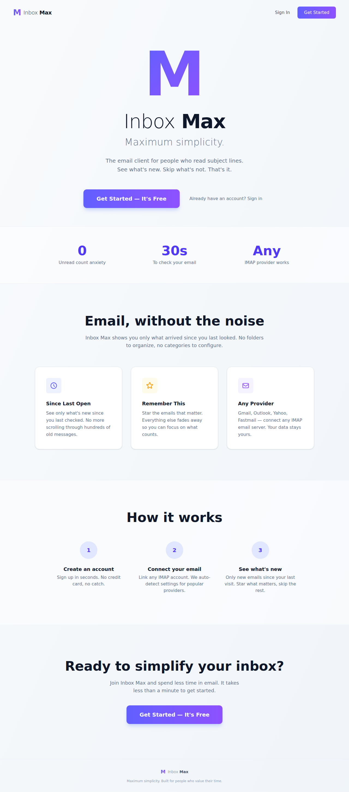
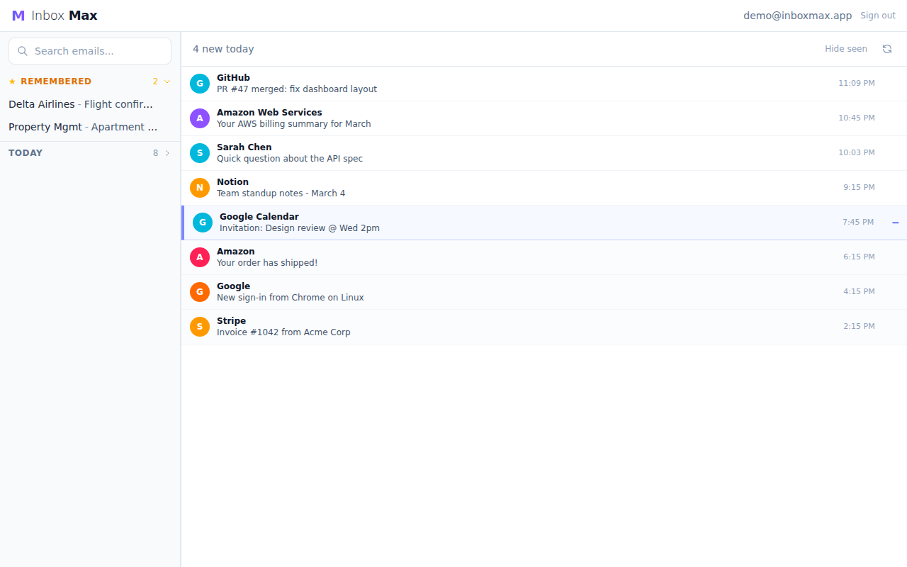

# Inbox Max

An email client for people who scan subject lines. Shows emails since you last opened the app, with a "remember this" bookmark feature.

Works with any IMAP provider (Gmail, Outlook, Yahoo, etc.).





## Prerequisites

- [Rust](https://rustup.rs/) (stable)
- [Node.js](https://nodejs.org/) (v18+)
- For Gmail: enable 2FA, then create an [App Password](https://myaccount.google.com/apppasswords)

## Build

```bash
# Install frontend dependencies (first time only)
cd client && npm install

# Build the frontend
cd client && npm run build

# Build the backend
cd server && cargo build --release
```

## Run

```bash
cd server && cargo run --release
```

Open **http://localhost:3001**

## Development

For faster iteration on the frontend with hot-reload, you can run Vite's dev server separately:

```bash
# Terminal 1: backend
cd server && cargo run

# Terminal 2: frontend dev server (proxies API calls to :3001)
cd client && npm run dev
```

Note: for the dev proxy to work, re-add this to `client/vite.config.js`:

```js
server: {
  proxy: { '/api': 'http://localhost:3001' },
},
```

## Tests

```bash
# Server unit + integration tests
cd server && cargo test

# Client unit tests
cd client && npm test

# End-to-end tests (requires running server)
cd e2e && npx playwright test
```

## Configuration

| Variable | Default | Description |
|----------|---------|-------------|
| `PORT` | `3001` | Server port |
| `DATABASE_URL` | `sqlite:data/inboxmax.db` | SQLite database path |
| `STATIC_DIR` | `../client/dist` | Path to built frontend |
