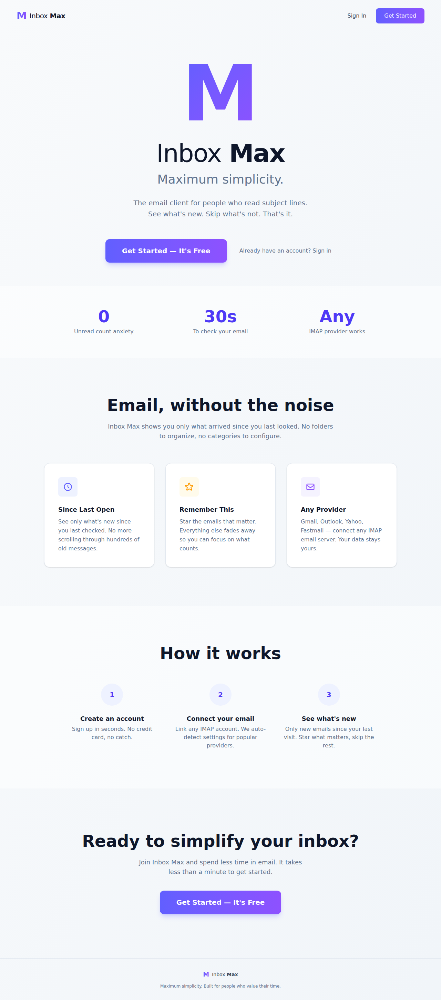
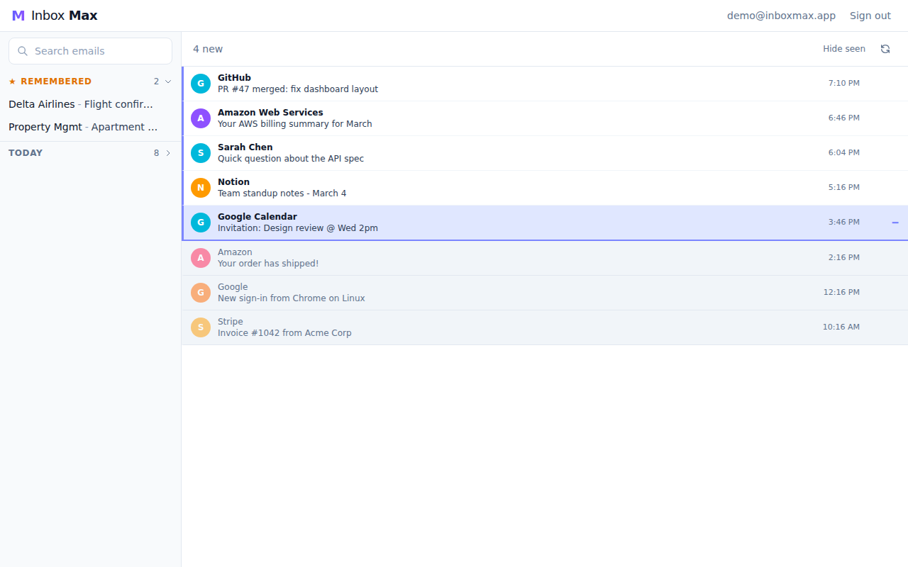

# Inbox Max

An email client for people who scan subject lines. Shows emails since you last opened the app, with a "remember this" bookmark feature.

New emails sit at the top. Below them, the last one you had seen is highlighted across the list,
like a selected message, and everything older is a greyed-out band, so you can see where you left off.
The marker advances when you leave the page or choose "Mark all seen", or you can place it yourself
(click ▾ on a row, or use the ↑/↓ keys in the list).
The interface follows your system's light or dark mode.

Works with IMAP providers that support password or app-password authentication
(Gmail, Outlook, Yahoo, and others), and handles several mailboxes side by side.

Inbox Max comes in two forms that share the same UI and mailbox code:

- **Web app** — a server you host; people register, sign in, and connect mailboxes.
- **Desktop app** — a Tauri app for Windows, macOS, and Linux with no server and no
  sign-in; mailbox passwords can be kept in the system keychain. See
  [desktop/README.md](desktop/README.md).





## Project layout

| Path | What it is | Used by |
|------|------------|---------|
| `crates/core` | Rust library: IMAP access, database and migrations, accounts, and the inbox operations (email window, last-seen marker, search, remembered) | both |
| `client` | React UI. `src/api.js` is its only way to the backend; the transport is HTTP for web (`src/transport/http.js`) or Tauri IPC for desktop (`src/transport/tauri.js`), chosen at build time | both |
| `server` | Web server: user registration and sign-in, sessions, rate limiting, and the HTTP API over `crates/core` | web |
| `desktop` | Tauri app: a local profile, OS keychain, and IPC commands over `crates/core` | desktop |
| `e2e` | Playwright tests for the web app | web |

Shared UI lives in `client/src/components` (`InboxPage` is the mail client itself);
`client/src/App.jsx` adds the web-only landing and sign-in pages, and
`client/src/DesktopApp.jsx` opens straight into the inbox.

## Web app

### Prerequisites

- [Rust](https://rustup.rs/) (stable)
- [Node.js](https://nodejs.org/) (v18+)
- For Gmail: enable 2FA, then create an [App Password](https://myaccount.google.com/apppasswords)

### Build

```bash
# Install frontend dependencies (first time only)
cd client && npm install

# Build the frontend
cd client && npm run build

# Build the backend
cd server && cargo build --release
```

### Run

```bash
cd server && cargo run --release
```

Open **http://localhost:3001**

### Development

For faster iteration on the frontend with hot-reload, you can run Vite's dev server separately:

```bash
# Terminal 1: backend
cd server && cargo run

# Terminal 2: frontend dev server (proxies API calls to :3001)
cd client && npm run dev
```

### Tests

```bash
# Rust unit + integration tests (core and web server)
cargo test

# The generated demo mailbox used by end-to-end tests
cargo test -p inboxmax-core --features fake-mail

# Client unit tests
cd client && npm test

# End-to-end tests (Playwright starts the server; build the client first)
cd client && npm run build
cd e2e && npx playwright test

# Regenerate the README screenshots in docs/
cd e2e && npm run screenshots
```

The end-to-end suite starts its own server on port 3101 with a throwaway database
(`server/target/e2e/inboxmax.db`), so it never touches your development data. That
server is built with a generated demo mailbox (see `INBOXMAX_FAKE_MAIL` below), so the
tests can connect any address without a real IMAP account.

To try the web app without a mail account:

```bash
cd server && INBOXMAX_FAKE_MAIL=1 cargo run --features fake-mail
```

### Configuration

| Variable | Default | Description |
|----------|---------|-------------|
| `PORT` | `3001` | Server port |
| `DATABASE_URL` | `sqlite:data/inboxmax.db` | SQLite database path |
| `STATIC_DIR` | `../client/dist` | Path to built frontend |
| `COOKIE_SECURE` | `false` | Set to `true` when serving through HTTPS |
| `INBOXMAX_FAKE_MAIL` | unset | With `1` and a `--features fake-mail` build, serve a generated demo mailbox instead of IMAP |

For safety, custom IMAP hosts must resolve to public IP addresses. Private,
loopback, link-local, and special-use network ranges are rejected, including
IPv6 forms (NAT64, 6to4, Teredo) that tunnel to them.

Failed sign-ins are limited to 10 per account, and rejected mailbox logins to 10
per user, in any 15-minute window.

Mailbox passwords are held only in server memory, so after a server restart each
user's mailboxes are listed as needing their password again.

### HTTP API

Sign-in: `POST /api/register`, `POST /api/signin`, `POST /api/signout`, `GET /api/auth/status`.
Mailboxes: `GET /api/accounts`, `POST /api/accounts` (connect), `DELETE /api/accounts/{id}`.
Per mailbox, under `/api/accounts/{id}`: `GET emails?since=`, `GET emails/{uid}`,
`GET search?q=`, `PUT watermark`, `GET remembered`, `POST|DELETE remembered/{uid}`.
The desktop app's IPC commands mirror these and return the same JSON.
