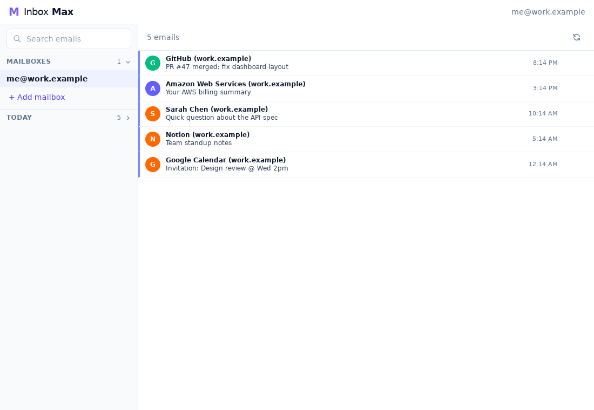

# Inbox Max desktop

The desktop app is the same React UI as the web app, running in the system
WebView through [Tauri 2](https://v2.tauri.app/), with the mailbox code from
`crates/core` compiled into the app. There is no local web server: the UI calls
Rust commands over Tauri IPC (`src/commands.rs`), which mirror the web API.



What differs from the web app:

- **No sign-in.** There is one local profile; the operating-system user account is
  the boundary. The app opens straight into the inbox.
- **Passwords in the keychain.** When connecting a mailbox you can keep its password
  in the macOS Keychain, Windows Credential Manager, or the Linux Secret Service
  (GNOME Keyring, KWallet). Saved mailboxes reconnect on launch. Without a usable
  keychain, passwords last until you quit.
- **Local data.** The database is `inboxmax.db` in the per-user app data directory
  (for example `~/.local/share/app.inboxmax.desktop` on Linux).
- **Links** in emails open in your default browser (web and `mailto:` links only).
- One running copy at a time: launching again focuses the open window.

## Prerequisites

- Rust (stable) and Node.js 18+
- Platform WebView and build tools, per the
  [Tauri prerequisites](https://v2.tauri.app/start/prerequisites/):
  - **Linux:** `libwebkit2gtk-4.1-dev libsoup-3.0-dev librsvg2-dev libxdo-dev build-essential`
    (Debian/Ubuntu names). A Secret Service provider such as GNOME Keyring for saved passwords.
  - **macOS:** Xcode Command Line Tools.
  - **Windows:** Microsoft C++ Build Tools. WebView2 ships with Windows 11 and is
    installed by the app installer on Windows 10.

```bash
cd client && npm install
cd ../desktop && npm install
```

## Run

```bash
cd desktop
npm run dev        # hot-reloading UI, real IMAP
npm run dev:demo   # the same with a generated demo mailbox (no mail account needed)
```

## Build installers

```bash
cd desktop
npm run build      # release build plus installers for this platform
```

Installers land in `target/release/bundle/` at the repository root (`.deb`, `.rpm`,
and AppImage on Linux; `.dmg`/`.app` on macOS; `.msi`/`.exe` on Windows). Builds are
unsigned for now, so macOS Gatekeeper and Windows SmartScreen will warn on first launch.

To regenerate the icons from `icons/source.png`: `npm run icons`.

## Tests

```bash
# Rust unit tests for the desktop state and credential handling
cargo test -p inboxmax-desktop

# End-to-end tests through WebDriver (Linux and Windows; macOS has no WKWebView driver)
cargo install tauri-driver --locked
npm run build:test     # debug build with the demo mailbox
npm run test:e2e
```

On Linux the end-to-end tests also need `webkit2gtk-driver` and a display; headless:

```bash
dbus-run-session -- xvfb-run -a npm run test:e2e
```

By default they run without a keychain. With an unlocked Secret Service they can also
check that saved passwords reconnect after a relaunch:

```bash
dbus-run-session -- bash -c 'echo -n pw | gnome-keyring-daemon --unlock --components=secrets; \
  INBOXMAX_TEST_KEYCHAIN=1 xvfb-run -a npm run test:e2e'
```

Set `SCREENSHOT_DIR` to keep screenshots of each screen (and of any failure).

### Accessibility tree (Linux)

`npm run inspect:a11y` drives the app to the connect, inbox, and reader screens and
prints each one's AT-SPI tree, which is what Orca reads. It needs `python3-pyatspi`
and the accessibility bus:

```bash
dbus-run-session -- bash -c '/usr/libexec/at-spi-bus-launcher --launch-immediately & \
  sleep 1; xvfb-run -a npm run inspect:a11y'
```

## Environment variables

| Variable | Effect |
|----------|--------|
| `INBOXMAX_FAKE_MAIL=1` | Use the generated demo mailbox (requires a `--features fake-mail` build) |
| `INBOXMAX_DATA_DIR` | Store the database here instead of the app data directory |
| `INBOXMAX_NO_KEYCHAIN=1` | Never use the OS keychain; passwords last until quit |
| `RUST_LOG` | Log filter, e.g. `inboxmax_core=debug` |
